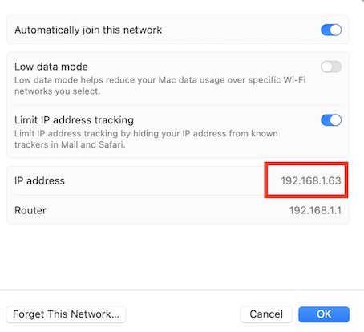
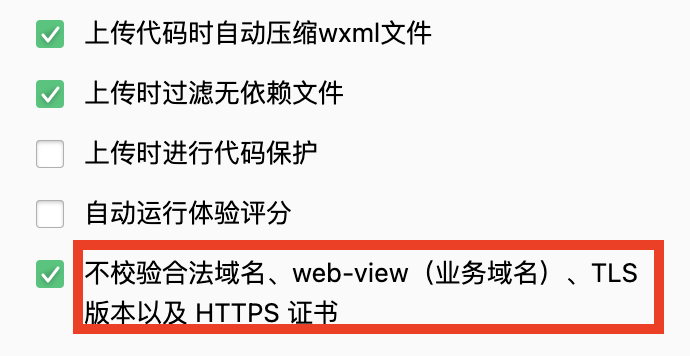

# 如何优化前后端联调

***
2022-12-01   
作者：cyy
***

### 之前的联调

前端一直调用的是测试服务器的接口，如果出现错误的话，后端人员要去定位，然后改完还需要自己调用接口测试一遍，然后再部署到服务器上。

而且有时问题不好排查，由于后端测试上没有日志，要花费大量的精力在找bug上。


### 简化繁琐的联调方式

步骤很简单，后端直接用自己的mac做服务器，在同一局域网下让前端访问，前后端都能看到报错的debug，后端还能及时定位和修改，前端能及时的获取到修改后的结果，简直是双赢。


### 后端要做的事

1.获取局域网ip（通过ifconfig命令或者wifi设置中）。  

2.启动项目并指定ip。  `flask run --host=192.168.1.63`


### 前端要做的事

1.拿小程序端举例，在项目中`config/local.js`中配置：
```
HOST: JSON.stringify('http://192.168.1.63:5000/api')
```

2.启动项目
```
yarn local:weapp
```

3.开启微信开发中工具中的不校验域名设置




4.联调成功

### 注意事项

1.前后端mac需处于同一wifi环境下

2.正式的mongo数据库无法在本地进行访问


